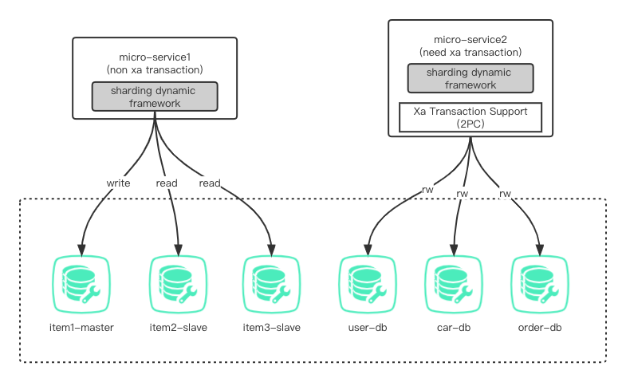

# Sharding-Dynamic

> Springboot整合MybatisPlus、Atomikos、多数据源读写分离

## 一、介绍
一款动态数据源的轻量级实现，支持通过注解动态切换数据源，支持xa分布式事务，对MybatisPlus查询自动读写分离，封装成Spring Starter方式引入。

## 二、软件架构


## 三、安装教程

将项目安装到本地仓库，或者公司私服

## 四、使用说明

1. 引入依赖

   ```xml
         <dependency>
           <groupId>com.github.hutiquan</groupId>
           <artifactId>spring-boot-starter-sharding</artifactId>
           <version>1.0-SNAPSHOT</version>
         </dependency>
   ```


2. application.yml中配置

```yaml
spring:
  datasource:
    sharding:
      primary: book
      print-banner: true
      sharding-group:
        book:
          datasource:
            - key: book1
              driver-class-name: com.mysql.cj.jdbc.Driver
              url: jdbc:mysql://localhost:3306/sharding1?useUnicode=true&characterEncoding=utf-8&allowMultiQueries=true&useAffectedRows=false&useSSL=false&serverTimezone=GMT%2B8
              username: root
              password: root
              cluster: MASTER
            - key: book2
              driver-class-name: com.mysql.cj.jdbc.Driver
              url: jdbc:mysql://localhost:3306/sharding2?useUnicode=true&characterEncoding=utf-8&allowMultiQueries=true&useAffectedRows=false&useSSL=false&serverTimezone=GMT%2B8
              username: root
              password: root
              cluster: SLAVE
            - key: book3
              driver-class-name: com.mysql.cj.jdbc.Driver
              url: jdbc:mysql://localhost:3306/sharding3?useUnicode=true&characterEncoding=utf-8&allowMultiQueries=true&useAffectedRows=false&useSSL=false&serverTimezone=GMT%2B8
              username: root
              password: root
              cluster: SLAVE
        order:
          datasource:
            - key: order1
              driver-class-name: com.mysql.cj.jdbc.Driver
              url: jdbc:mysql://localhost:3306/order1?useUnicode=true&characterEncoding=utf-8&allowMultiQueries=true&useAffectedRows=false&useSSL=false&serverTimezone=GMT%2B8
              username: root
              password: root
              cluster: MASTER
```

2. 通过在方法上、Mapper接口上加@Sharding注解动态切换数据源，如果不加默认使用配置的primary数据源，方法上的注解比类上注解优先级高

3. Mybatis读写分离数据源负载均衡模式默认为轮询，通过以下方式改成随机模式，也可以通过实现ShardingDataSourceDetermineStrategy接口来自定义负载均衡模式

   ```java
     @Bean
     public RandomShardingStrategy randomShardingStrategy(){
       return new RandomShardingStrategy();
     }
   ```